# Gallinero Moderno Doble (DIY)

> Instrucciones adaptadas al español chileno con medidas en sistema métrico y materiales disponibles en Chile.
> Fuente original: [Ana-White.com](https://www.ana-white.com/woodworking-projects/double-wide-modern-chicken-coop)

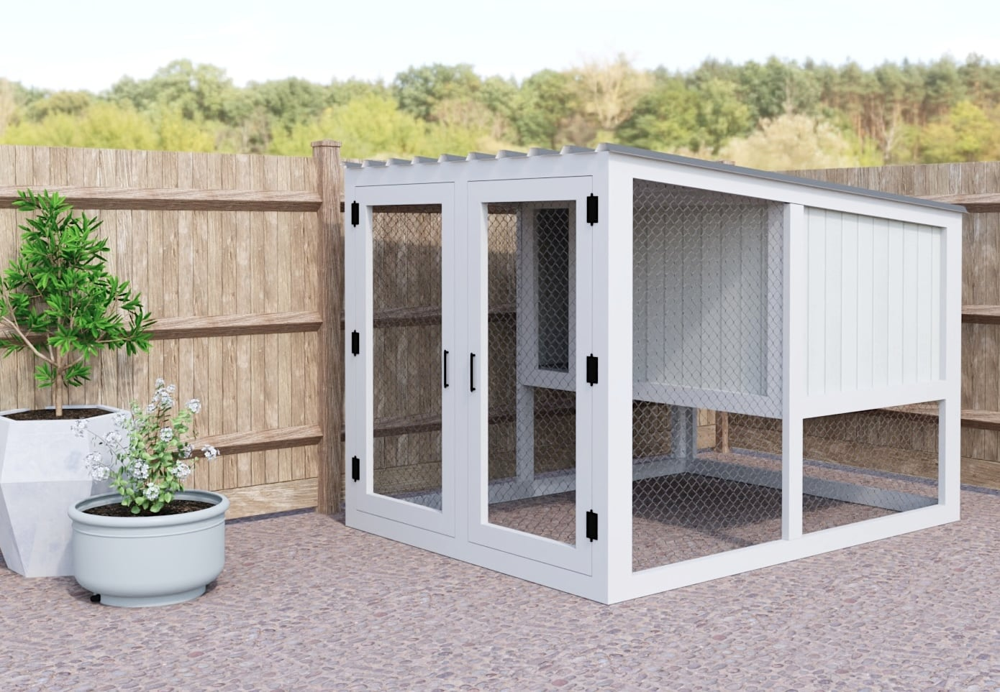

> _Nota: esta imagen es un render del plano, no una fotografía del proyecto terminado._

**Dificultad:** Avanzado

Construye tu propio gallinero moderno de ancho doble. Está diseñado para dos planchas de zinc estándar que no necesitan cortarse. El gallinero se construye en paneles y luego se ensambla; las planchas de zinc simplemente se superponen encima.

Este gallinero tiene toda el área cubierta con corral integrado. El área cerrada del gallinero tiene aproximadamente **2,2 m²** y el corral abierto cuenta con **4,5 m² adicionales**. Las puertas dobles delanteras facilitan la limpieza. El área cerrada del gallinero tiene puertas dobles para acceder al nidal, al bebedero y al comedero.

---

## Dimensiones

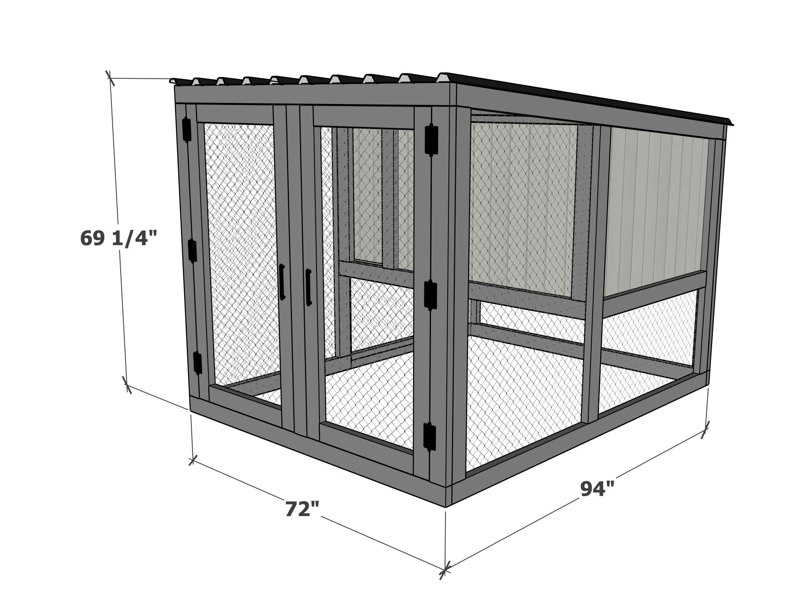

> 📐 **Texto en la imagen (traducido al español, medidas en centímetros):**
> - Base: aprox. **180 cm × 244 cm** | Altura aprox. **180 cm**
> - Profundidad interior: **175,9 cm** (69 1/4")
> - Diseñado para dos planchas de zinc estándar sin cortes

---

## Lista de compras

| Cantidad | Material |
|----------|----------|
| ~30 | Pieza de madera 2×4 (5×10 cm) de **244 cm** de largo — **Pino Oregón** (disponible en Sodimac/Easy) |
| 2 | Panel de revestimiento T1-11 de **12 mm** de espesor — sustituir por **plywood exterior de 12 mm** o **OSB exterior de 12 mm** (ferreterías de construcción) |
| 1 | Tablero de plywood CDX o terciado exterior de **12 mm** — para el piso del gallinero |
| ~100 | Tornillos autoperforantes tipo estrella de **45 mm** para exterior |
| ~100 | Tornillos autoperforantes tipo estrella de **64 mm** para exterior |
| ~100 | Tornillos de bolsillo de **64 mm** |
| 2 | Plancha de zinc de **91 cm × 244 cm** (paneles de techo metálico estándar) |
| ~50 | Tornillos autoperforantes para metal de **45 mm** (para fijar las planchas de zinc) |
| ~4,9 m | Malla de gallinero de **122 cm** de ancho |
| ~4,9 m | Malla de gallinero de **61 cm** de ancho |
| — | Grapas para fijar la malla |
| — | Pinza cortaalabre para cortar la malla |
| 10 | Bisagras para exterior |
| 4 | Tiradores para exterior |
| — | Pasadores o cierres para mantener las puertas cerradas |

> **Notas sobre materiales en Chile:**
> - El panel T1-11 es un revestimiento estructural ranurado muy común en EE.UU. En Chile no se vende con ese nombre, pero puede sustituirse por **plywood exterior de 12 mm** o **OSB exterior de 12 mm**, disponibles en Sodimac, Easy o madereras. La cara vista queda hacia afuera.
> - Las piezas 2×4 se comercializan como **Pino Oregón** en Chile. No se recomienda madera tratada químicamente en el interior del gallinero para evitar contaminación.
> - Apoya la base del gallinero sobre baldosas de hormigón o una capa de grava drenante para proteger las maderas inferiores.

---

## Lista de corte

### Paredes laterales (construir 2 en espejo)

| Cant. | Material | Largo |
|-------|----------|-------|
| 2 | 2×4 | **232,4 cm** — punto largo a punto corto, ambos extremos a 5° fuera de escuadra, extremos paralelos |
| 2 | 2×4 | **231,4 cm** |
| 2 | 2×4 | **135,3 cm** — punto largo, un extremo a 5° fuera de escuadra |
| 2 | 2×4 | **145,7 cm** — punto largo, un extremo a 5° fuera de escuadra |
| 2 | 2×4 | **154,9 cm** — punto largo, un extremo a 5° fuera de escuadra |
| 2 | 2×4 | **109,9 cm** |
| 2 | Panel (plywood/OSB 12 mm) | **121,9 cm** de ancho × **101,9 cm** (punto largo) y **91,1 cm** (punto corto) — cortar en espejo |

### Pared trasera

| Cant. | Material | Largo |
|-------|----------|-------|
| 2 | 2×4 | **182,9 cm** |
| 2 | 2×4 | **134,3 cm** |
| 1 | 2×4 | **165,1 cm** |
| 1 | 2×4 | **73,3 cm** |

### Pared delantera

| Cant. | Material | Largo |
|-------|----------|-------|
| 2 | 2×4 | **182,9 cm** |
| 3 | 2×4 | **154,9 cm** |

### Pared interior

| Cant. | Material | Largo |
|-------|----------|-------|
| 2 | 2×4 | **175,3 cm** |
| 3 | 2×4 | **84,5 cm** |
| 1 | Panel (plywood/OSB 12 mm) | **121,9 cm × 102,2 cm** |

### Estructura adicional

| Cant. | Material | Largo |
|-------|----------|-------|
| 4 | 2×4 | **~172,7 cm** — medir y cortar a medida, para el interior del área cerrada |
| 1 | 2×4 | **175,3 cm** — para sostener las planchas de techo |
| 1 | Plywood 12 mm (piso) | **~121,9 cm × 175,3 cm** — medir y cortar a medida |

### Puertas traseras (medir y cortar a medida; estas son estimaciones)

| Cant. | Material | Largo |
|-------|----------|-------|
| 4 | 2×4 | **72,7 cm** |
| 4 | 2×4 | **59,7 cm** |
| 2 | Panel (plywood/OSB 12 mm) | **~66 cm × 66 cm** |

### Puertas delanteras (medir y cortar a medida; estas son estimaciones)

| Cant. | Material | Largo |
|-------|----------|-------|
| 4 | 2×4 | **154,3 cm** |
| 4 | 2×4 | **59,7 cm** |

---

## Instrucciones

> **Aviso general:** Este es un plano avanzado y debe construirse con conocimiento de prácticas de construcción en madera. Se recomienda usar un sistema de tornillos de bolsillo (tipo Kreg Jig) para las uniones. La madera inferior (que queda cerca del suelo) debe protegerse con pintura o barniz sellador para exterior, o apoyarse sobre baldosas de hormigón o grava para evitar la humedad.

---

### Paso 1 — Paredes laterales

[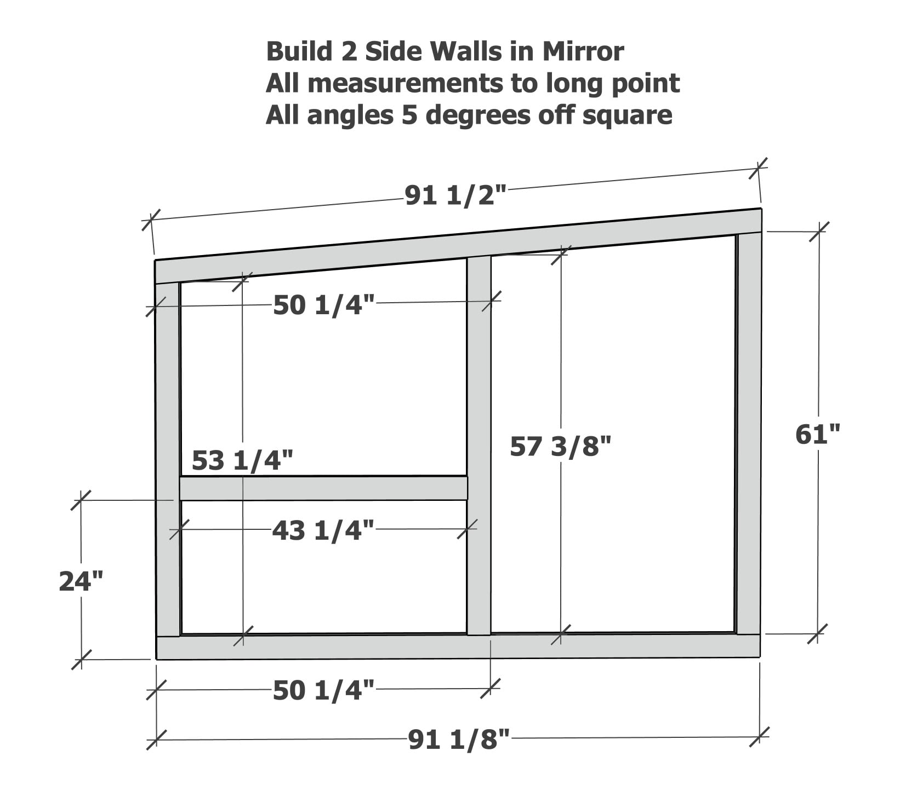](imagenes-doble/paso-1.jpg)

> 📐 **Texto en la imagen (traducido al español, medidas en centímetros):**
> - Construir 2 paredes laterales en espejo
> - Todas las medidas al punto largo
> - Todos los ángulos a **5° fuera de escuadra**
> - Pieza corta vertical: **127,6 cm** (50 1/4")
> - Pieza inferior larga: **231,4 cm** (91 1/8")
> - Piezas anguladas: **135,3 cm** (53 1/4"), **145,7 cm** (57 3/8"), **154,9 cm** (61")

Corta y distribuye las dos paredes laterales de modo que queden en espejo.

Marca las ubicaciones de los agujeros de bolsillo.

Perfora agujeros de bolsillo de **38 mm** (1-1/2"), dos por unión, en todas las uniones.

Fija con tornillos de bolsillo de **64 mm** para exterior.

---

### Paso 2 — Panel y malla laterales

[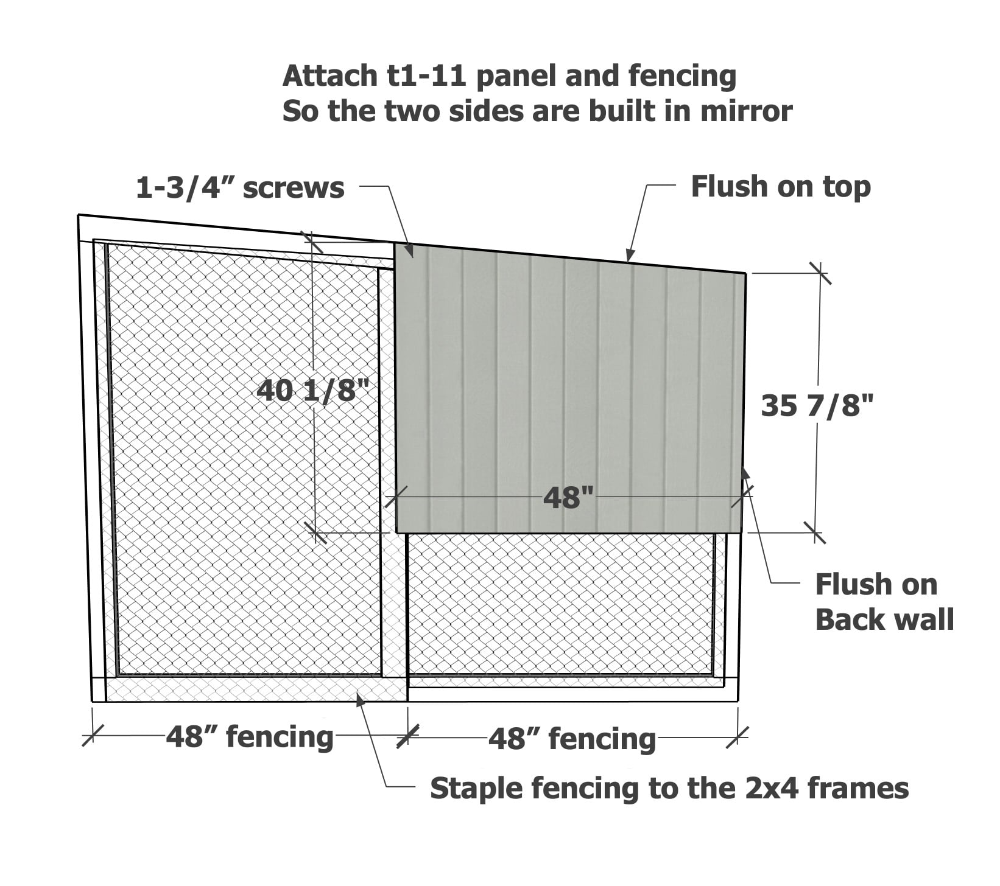](imagenes-doble/paso-2.jpg)

> 📐 **Texto en la imagen (traducido al español, medidas en centímetros):**
> - Fijar el panel y la malla de modo que los dos laterales queden en espejo
> - Tornillos de **45 mm**, al ras por la parte superior
> - Malla de **122 cm** de ancho (48")
> - Grapar la malla a los marcos 2×4

Corta los paneles de plywood/OSB de 12 mm para que encajen en el interior del lateral, con la cara vista hacia afuera.

Fija con tornillos de **45 mm**.

Repite para el segundo lateral, de modo que ambos queden en espejo.

Agrega la malla de **122 cm** de ancho en las áreas abiertas. Recorta el exceso.

> **Consejo:** Aplica pintura o terminación antes de agregar la malla para un trabajo más prolijo.

---

### Paso 3 — Panel pared trasera

[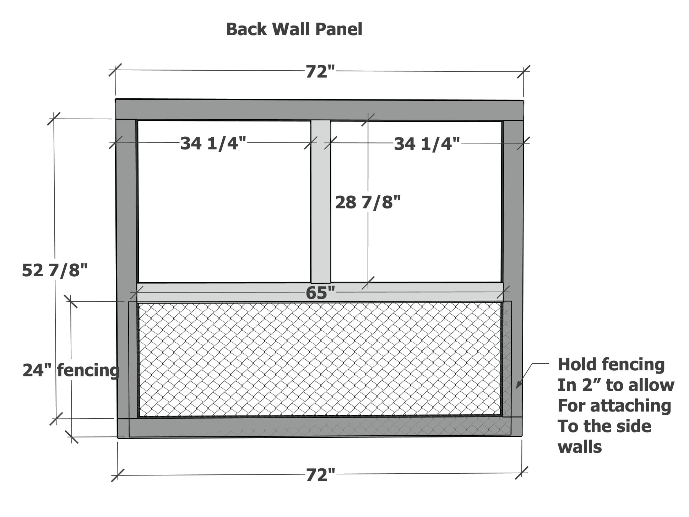](imagenes-doble/paso-3.jpg)

> 📐 **Texto en la imagen (traducido al español, medidas en centímetros):**
> - Secciones interiores: **87 cm** (34 1/4") a cada lado
> - Pieza corta interior: **73,3 cm** (28 7/8")
> - Pieza vertical larga: **134,3 cm** (52 7/8")
> - Malla de **61 cm** de ancho (24")
> - Dejar **5 cm** de borde libre de malla en todos los lados para poder fijar a las paredes laterales

Construye el panel de la pared trasera usando agujeros de bolsillo de **38 mm** y tornillos de bolsillo de **64 mm**.

> **Consejo:** Pinta o tiñe antes de agregar la malla.

Agrega la malla de **61 cm** de ancho en la parte inferior.

---

### Paso 4 — Panel pared delantera

[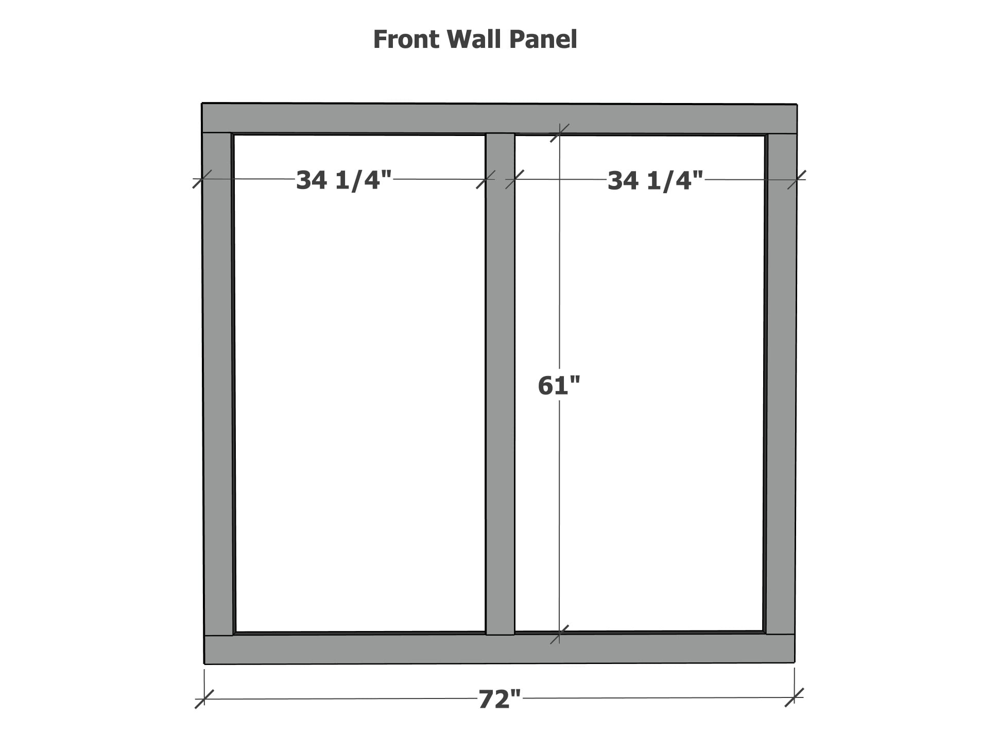](imagenes-doble/paso-4.jpg)

> 📐 **Texto en la imagen (traducido al español, medidas en centímetros):**
> - Secciones interiores: **87 cm** (34 1/4") a cada lado

Construye el panel de la pared delantera con agujeros de bolsillo de **38 mm** y tornillos de bolsillo de **64 mm**.

---

### Paso 5 — Ensamblaje de los cuatro paneles

[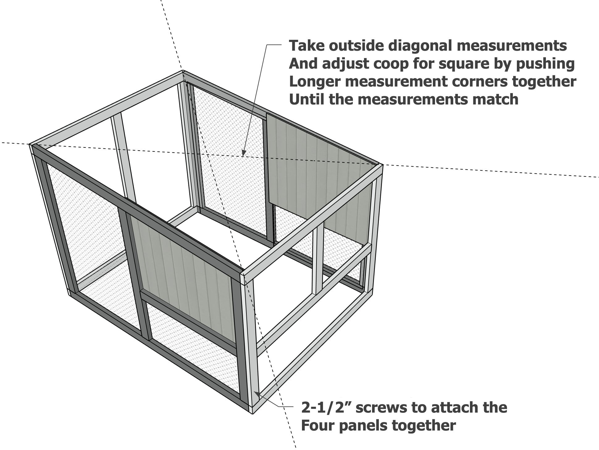](imagenes-doble/paso-5.jpg)

> 📐 **Texto en la imagen (traducido al español):**
> - Tomar medidas diagonales exteriores y ajustar el gallinero empujando las esquinas de la diagonal más larga hasta que las medidas coincidan
> - Tornillos autoperforantes de **64 mm** para unir los cuatro paneles

Une los cuatro paneles en la ubicación definitiva. Fija en las esquinas con tornillos autoperforantes de **64 mm**.

Ajusta el marco del gallinero para que quede perfectamente cuadrado midiendo las diagonales.

---

### Paso 6 — Estructura de la pared interior

[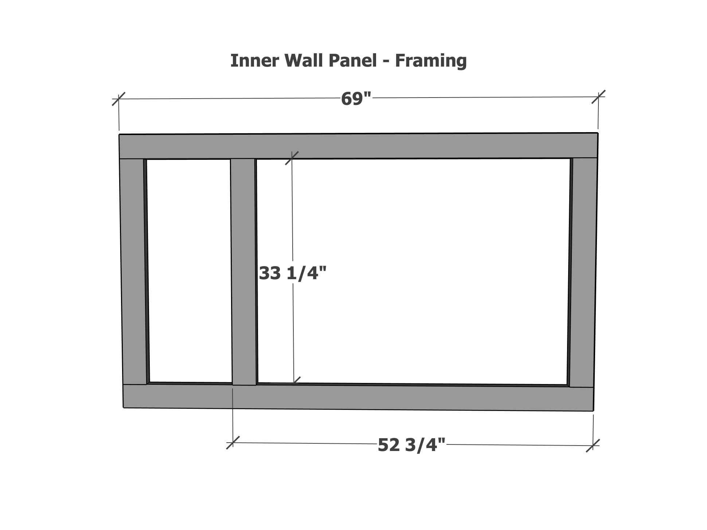](imagenes-doble/paso-6.jpg)

> 📐 **Texto en la imagen (traducido al español, medidas en centímetros):**
> - Largo de la pared interior: **134 cm** (52 3/4")

Construye la estructura de la pared interior como se muestra, usando agujeros de bolsillo de **38 mm**, tornillos de bolsillo de **64 mm** y cola (pegamento para madera).

---

### Paso 7 — Revestimiento de la pared interior

[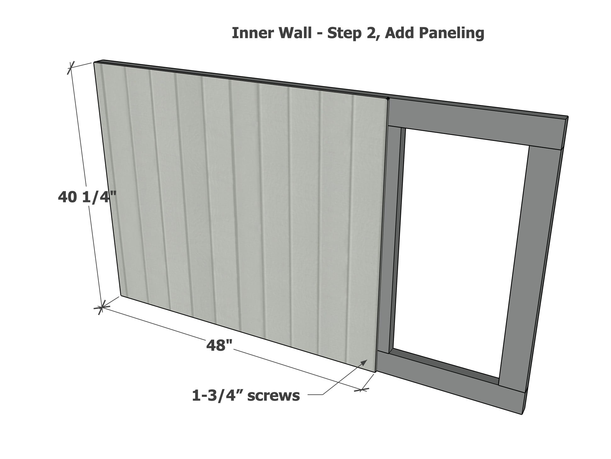](imagenes-doble/paso-7.jpg)

> 📐 **Texto en la imagen (traducido al español, medidas en centímetros):**
> - Largo del panel: **~102 cm** (40 1/4")
> - Tornillos de **45 mm**

Agrega el panel de plywood/OSB de 12 mm con tornillos de **45 mm**, al ras con el lateral y la parte superior.

---

### Paso 8 — Instalación de la pared interior

[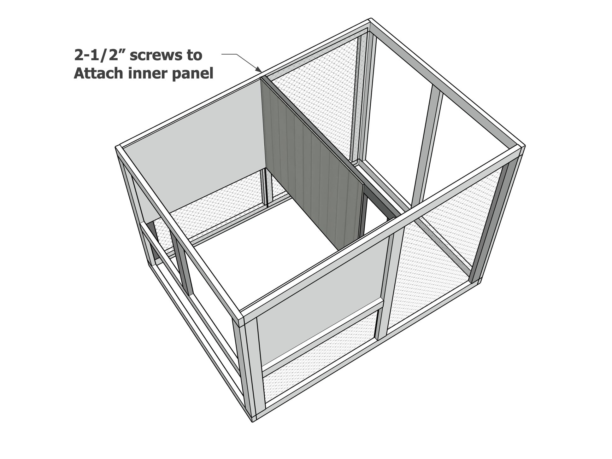](imagenes-doble/paso-8.jpg)

Encaja la pared interior dentro del gallinero y fija con tornillos de **64 mm**.

---

### Paso 9 — Estructura interior (vigas de piso y techo)

[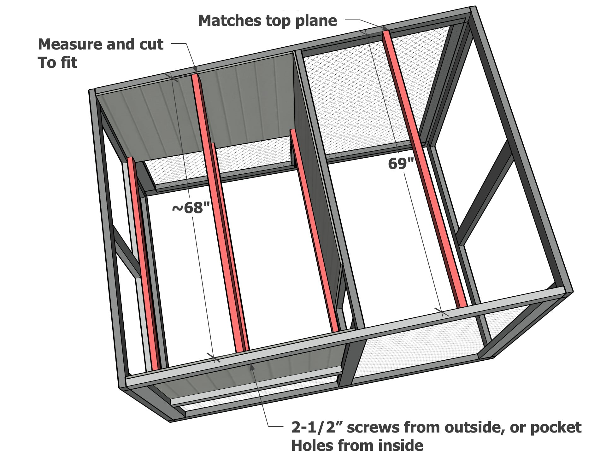](imagenes-doble/paso-9.jpg)

> 📐 **Texto en la imagen (traducido al español):**
> - La viga superior debe coincidir con el plano del techo (mismo ángulo que las paredes laterales)
> - Medir y cortar a medida
> - Tornillos de **64 mm** desde el exterior, o tornillos de bolsillo desde el interior

Mide y corta piezas 2×4 a medida para que encajen en el interior del gallinero, sirviendo como soporte del piso y del techo.

La viga del techo debe seguir el mismo plano que las paredes laterales, para que las planchas de zinc puedan apoyarse correctamente.

---

### Paso 10 — Piso de plywood

[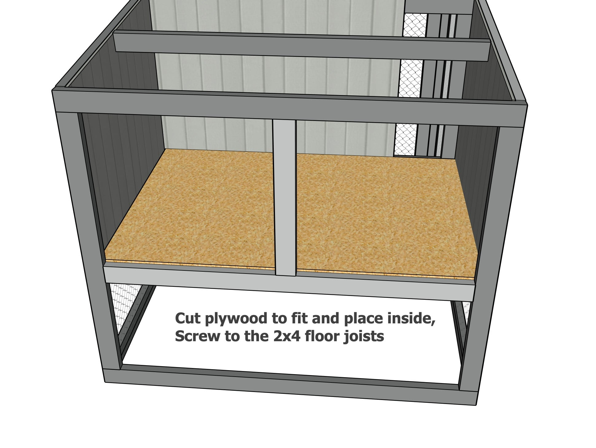](imagenes-doble/paso-11.jpg)

> 📐 **Texto en la imagen (traducido al español):**
> - Cortar el plywood a medida, colocarlo adentro y atornillarlo a las vigas del piso 2×4

Mide y corta el plywood del piso, instálalo y atorníllalo. El piso de plywood contribuye a la estructura general del gallinero.

---

### Paso 11 — Puertas traseras

[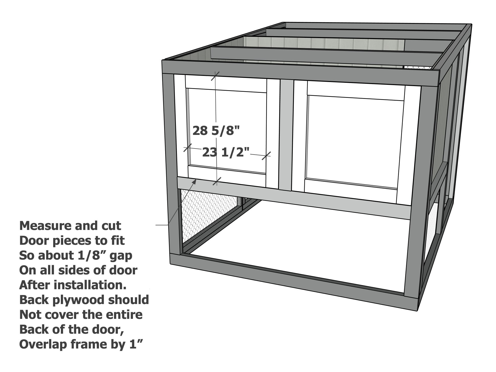](imagenes-doble/paso-10.jpg)

> 📐 **Texto en la imagen (traducido al español, medidas en centímetros):**
> - Marco de puerta: **72,7 cm** (28 5/8") × **59,7 cm** (23 1/2")
> - Medir y cortar las piezas de cada puerta para que haya aprox. **3 mm** de holgura en todos los lados tras la instalación
> - El panel de plywood trasero no debe cubrir todo el reverso de la puerta; superponer el marco en **2,5 cm**

Mide las puertas y córtalas dejando **6 mm** menos que la abertura total, para obtener una holgura de **3 mm** en cada lado tras instalarlas.

Considera el grosor del piso de plywood al fijar los paneles en la parte trasera de las puertas.

Instala con bisagras y pasadores.

---

### Paso 12 — Puertas delanteras

[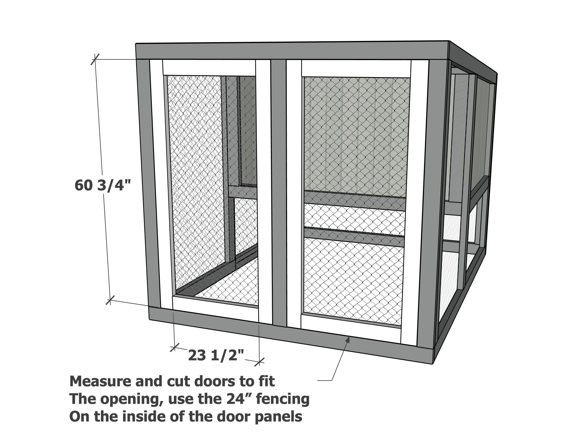](imagenes-doble/paso-12.jpg)

> 📐 **Texto en la imagen (traducido al español, medidas en centímetros):**
> - Marco de puerta delantera: **154,3 cm** (60 3/4") × **59,7 cm** (23 1/2")
> - Medir y cortar puertas a medida
> - Usar malla de **61 cm** de ancho en el interior de los marcos de puertas

Repite el proceso para las puertas delanteras, pero agrega malla de gallinero a los marcos abiertos. Instala con bisagras y pasadores.

---

### Paso 13 — Techo de zinc

[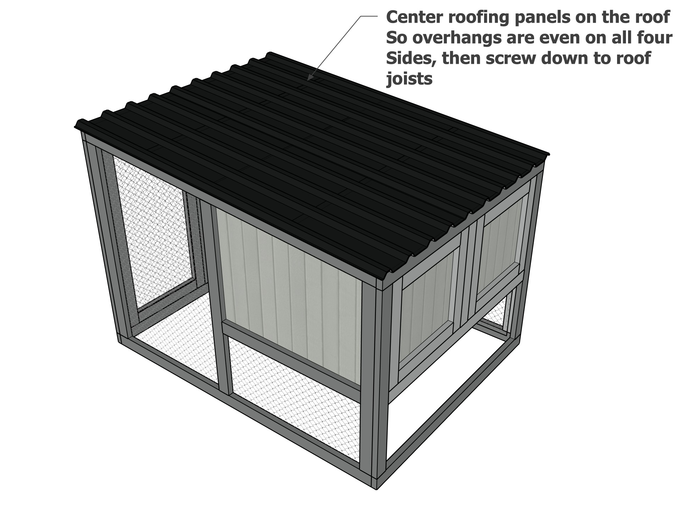](imagenes-doble/paso-13.jpg)

> 📐 **Texto en la imagen (traducido al español):**
> - Centrar los paneles de zinc en el techo de modo que el voladizo sea parejo en los cuatro lados
> - Luego atornillar a las paredes y a los travesaños del techo

Coloca las planchas de zinc sobre el techo y céntralas para que el voladizo sea parejo en los cuatro lados.

Atornilla las planchas a las cuatro paredes y a las vigas 2×4 del techo con tornillos para metal.

---

## Terminación

Se recomienda una tintura penetrante para exterior de base agua, del tipo que se usa para terminar una reja o cerco. Aplica en toda la madera exterior antes o después del ensamblaje para mayor durabilidad.

---

*Plano e instrucciones originales por [Ana White](https://www.ana-white.com/woodworking-projects/double-wide-modern-chicken-coop). Adaptado al español chileno con medidas métricas y materiales locales.*
