# Gallinero Moderno Pequeño (DIY)

> Instrucciones adaptadas al español chileno con medidas en sistema métrico y materiales disponibles en Chile.
> Fuente original: [Ana-White.com](https://www.ana-white.com/woodworking-projects/small-modern-chicken-coop)

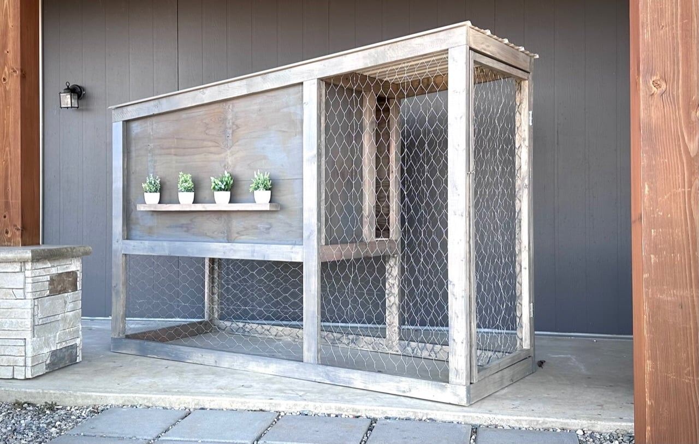

**Dificultad:** Intermedio

Construye tu propio gallinero de estilo moderno. Su perfil angosto lo hace ideal para cualquier patio, tanto urbano como rural. Este gallinero es para 2–4 gallinas, e incluye un nidal (ponedero) y un corral integrado. Es fácil de limpiar y alimentar. El gallinero está completamente techado para mantenerse seco, con opciones de sombra y sol.

---

## Fotos del proyecto

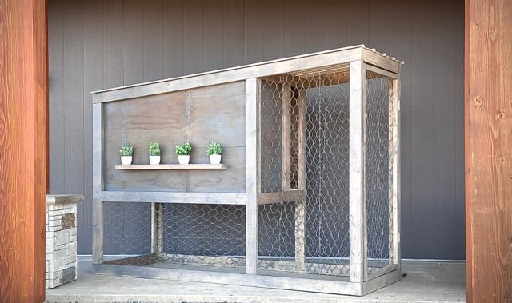

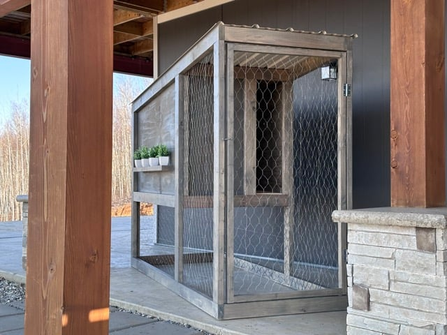

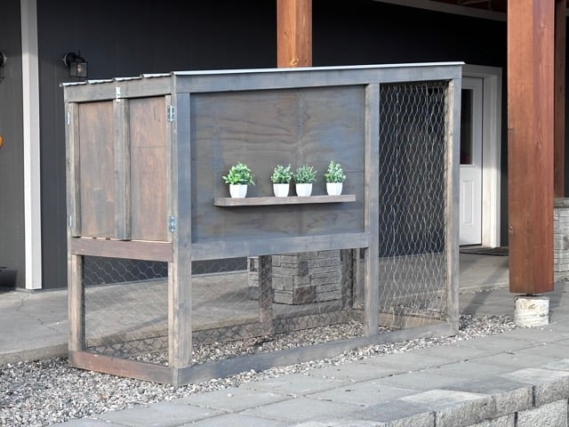

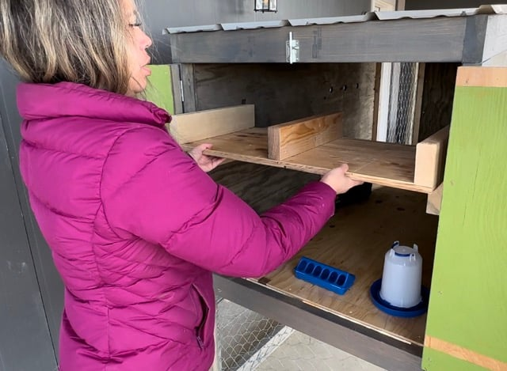

---

## Características del gallinero

- Estilo moderno
- Perfil angosto, cabe en casi cualquier espacio
- Combinación de gallinero, nidal y corral
- Piso y nidal desmontables para limpieza
- Fácil de limpiar: abre la puerta, raspa hacia un balde y agrega cama nueva
- Amigable para el constructor aficionado: diseñado para una sola plancha de zinc y técnicas de construcción simples

---

## Dimensiones

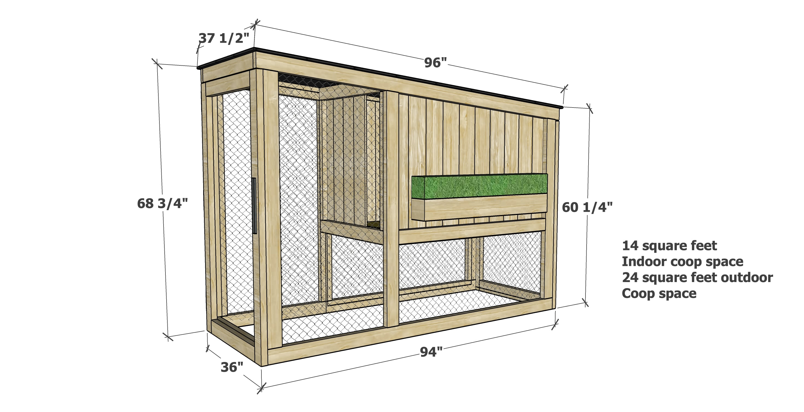

> 📐 **Texto en la imagen (traducido al español, medidas en centímetros):**
> - Largo total base: **239 cm** | Profundidad base: **91,4 cm**
> - Altura total (lado izquierdo): **174,6 cm** | Altura (lado derecho): **153 cm**
> - Largo del techo: **244 cm** | Profundidad del techo: **95 cm**
> - **1,3 m²** de espacio interior del gallinero
> - **2,2 m²** de espacio del corral exterior

**Superficie aproximada: 244 cm × 91 cm**

---

## Lista de compras

| Cantidad | Material |
|----------|----------|
| 6 | Pieza de madera 2×4 (5×10 cm) de **3,05 m** de largo |
| 8 | Pieza de madera 2×4 (5×10 cm) de **2,44 m** de largo |
| 2 | Pieza de madera 2×2 (5×5 cm) de **2,44 m** de largo |
| 15 | Tabla de cedro o ciprés de **14 cm** de ancho × **183 cm** de largo (equivalente a estaca de cerco) |
| 1 | Tablero de plywood exterior de **1,22 × 2,44 m**, espesor **19 mm** (3/4") |
| 1 | Plancha de zinc de **95 cm × 2,44 m** |
| 16 | Tornillos autoperforantes para metal (para fijar la plancha de zinc al techo) |
| 6 m | Malla de gallinero de **90 cm** de ancho |
| 4,5 m | Malla de gallinero de **60 cm** de ancho |
| 100 | Tornillos de bolsillo de **65 mm** para exterior |
| 120 | Tornillos autoperforantes tipo estrella de **32 a 45 mm** |
| 20 | Tornillos autoperforantes tipo estrella de **65 mm** |
| — | Grapas para fijar malla |
| 2 pares | Bisagras para exterior |
| 2 | Pasadores o aldabas |

> **Nota sobre la madera:** Se recomienda usar **Pino Oregón** (conocido así en Chile) para las piezas de 2×4, ya que ofrece buen equilibrio entre costo y durabilidad. También puedes usar **cedro** o **ciprés**, ambos con buena resistencia a la intemperie. No se recomienda madera tratada con químicos, ya que las gallinas pueden picotearla. Para las tablas de cerco, **Pino Radiata** es ampliamente disponible y económico en Chile. Colocar la base sobre baldosas de hormigón ayuda con el drenaje.

---

## Lista de cortes

### Marcos laterales

| Cantidad | Dimensión |
|----------|-----------|
| 2 | 2×4 @ **240 cm** — ambos extremos cortados a 5° fuera de escuadra, extremos paralelos (medida de punto largo a punto corto) |
| 2 | 2×4 @ **155 cm** — un extremo cortado a 5° fuera de escuadra, medida de punto largo\* |
| 2 | 2×4 @ **148 cm** — un extremo cortado a 5° fuera de escuadra, medida de punto largo\* |
| 2 | 2×4 @ **135 cm** — un extremo cortado a 5° fuera de escuadra, medida de punto largo\* |
| 2 | 2×4 @ **231,5 cm** |
| 2 | 2×4 @ **133,5 cm**\* |

### Sistema central

| Cantidad | Dimensión |
|----------|-----------|
| 7 | 2×4 @ **84 cm** |
| 2 | 2×2 @ **140 cm** |
| 2 | 2×2 @ **86,7 cm** |
| 1 | Plywood 19 mm @ **81 cm × 138,5 cm** — piso |

### Puertas

| Cantidad | Dimensión |
|----------|-----------|
| 2 | 2×4 @ **163 cm**\* |
| 2 | 2×4 @ **142 cm**\* |
| 5 | 2×4 @ **74 cm** |

### Nidal (ponedero)

| Cantidad | Dimensión |
|----------|-----------|
| 1 | Plywood 19 mm @ **33 cm × 80 cm** |
| 3 | Plywood 19 mm @ **33 cm × 15 cm** |
| 1 | 1×3 @ **80 cm** |

\*Cortar de las piezas de 3,05 m de largo

> **Instrucciones de corte:** Realiza primero los cortes más largos para aprovechar mejor el material. Para el plywood, corta en tiras de **81 cm** y **33 cm** de ancho por 2,44 m de largo. El piso se obtiene de la tira de 81 cm. El nidal se obtiene de la tira de 33 cm. Los retazos pueden usarse para la parte delantera y trasera del nidal.

---

## Herramientas necesarias

- Huincha de medir
- Escuadra de carpintero
- Lápiz de marcar
- Antiparras de seguridad
- Sistema de bolsillos de unión (Kreg Jig o similar)
- Taladro
- Sierra ingleteadora (o sierra circular con guía)
- Pistola engrapadora

---

## Instrucciones de construcción

> **Consejo general:** Para mayor durabilidad y resultados más profesionales, se recomienda usar un sistema de unión con tornillos de bolsillo (pocket hole joinery) para las uniones de madera.

---

### Paso 1 — Marcos laterales

[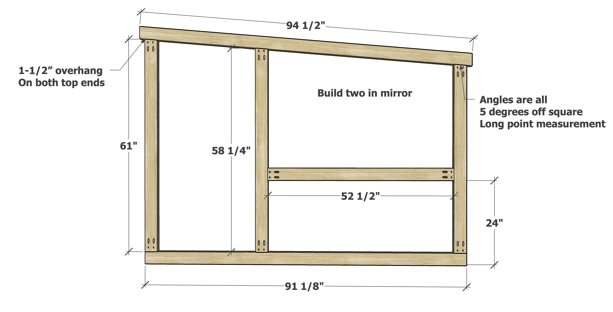](imagenes/paso-1.jpg)

> 📐 **Texto en la imagen (traducido al español, medidas en centímetros):**
> - Largo superior: **240 cm** | Largo inferior: **231,4 cm**
> - Alto exterior (columna lateral): **155 cm** | Alto interior superior: **148 cm** | Alto interior inferior: **133,4 cm**
> - Ancho del corral inferior: **61 cm**
> - Voladizo de **3,8 cm** en ambos extremos superiores
> - Construir dos en espejo
> - Todos los ángulos son **5° fuera de escuadra**, medida de punto largo

Coloca las dos piezas del marco lateral de modo que queden en espejo.

Marca todos los agujeros de bolsillo.

Perfora agujeros de bolsillo de **38 mm** (1-1/2") en los extremos según el diagrama.

Fija con tornillos de bolsillo de **65 mm**.

Construye el segundo marco en espejo al primero.

> **Consejo:** Es mucho más fácil pintar antes de agregar la malla. Se recomienda dar una capa rápida de terminación en el interior del marco antes de instalar la malla.

---

### Paso 2 — Malla de gallinero

[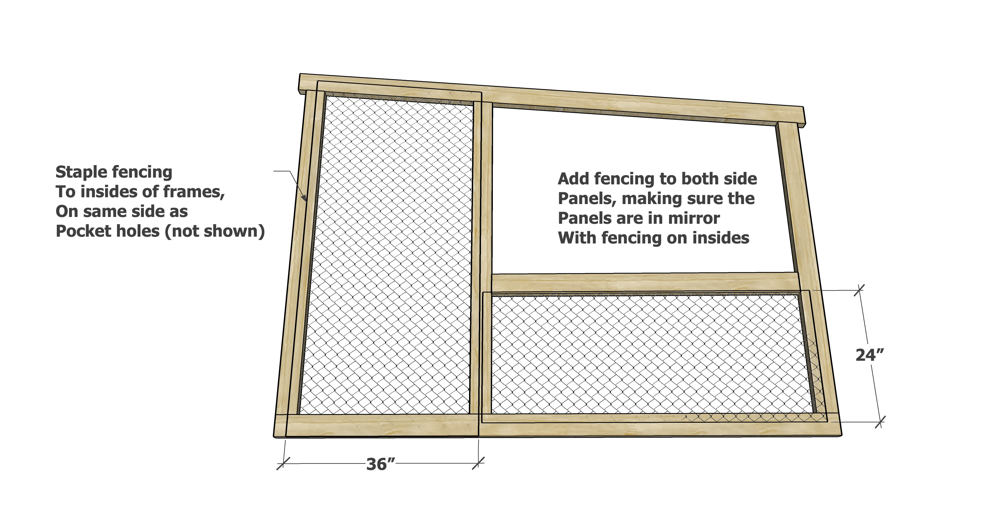](imagenes/paso-2.jpg)

> 📐 **Texto en la imagen (traducido al español):**
> - Grapar la malla al interior del marco, en el mismo lado que los agujeros de bolsillo (no mostrados)
> - Agregar malla a ambos paneles laterales, asegurándose de que queden en espejo con la malla hacia adentro

Fija la malla de gallinero o malla metálica al interior del marco con grapas. Recorta si es necesario y dobla los bordes hacia adentro.

---

### Paso 3 — Soporte del piso

[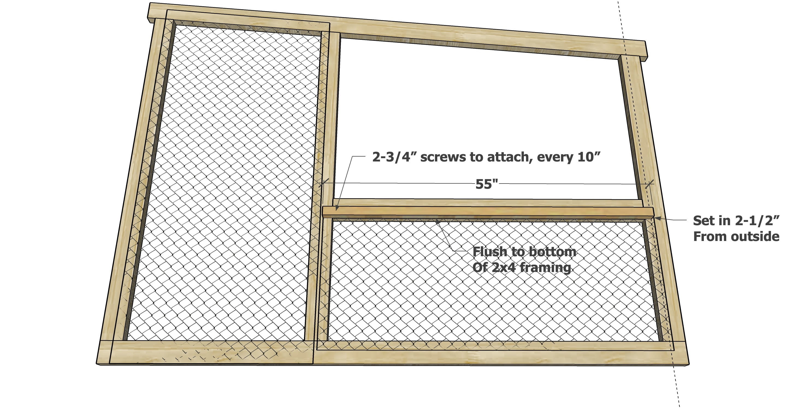](imagenes/paso-3.jpg)

> 📐 **Texto en la imagen (traducido al español, medidas en centímetros):**
> - Largo del listón 2×2: **140 cm**
> - Tornillos de **7 cm** para fijar, cada **25 cm**
> - Colocar el listón **6,4 cm** hacia adentro desde el exterior
> - Al ras de la parte inferior del marco 2×4

Agrega los listones de 2×2 (soporte del piso) al interior del marco lateral usando tornillos más largos.

---

### Paso 4 — Primera tabla de cerco lateral

[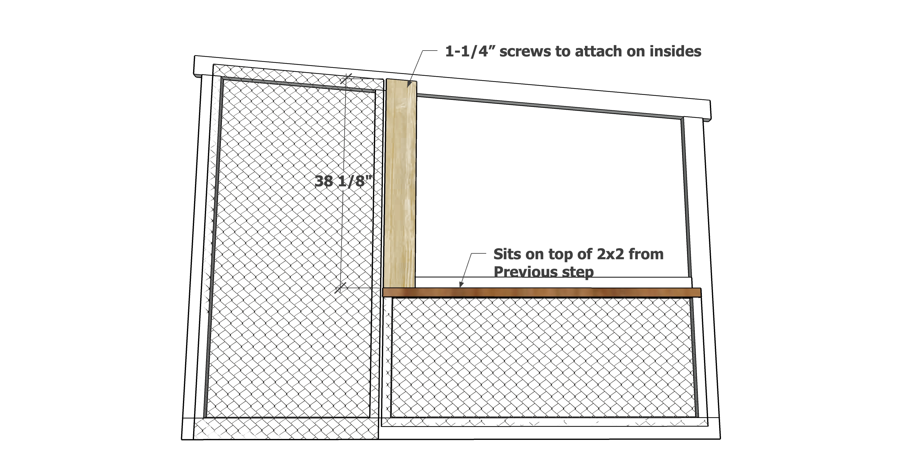](imagenes/paso-4.jpg)

> 📐 **Texto en la imagen (traducido al español, medidas en centímetros):**
> - Alto de la primera tabla de cerco: **96,8 cm**
> - Tornillos de **3,2 cm** para fijar por el interior
> - La tabla se apoya encima del listón 2×2 del paso anterior

> **Alternativa:** En el video se usó plywood exterior de **12 mm** (1/2") en lugar de tablas de cerco. Esto sirve, pero genera mucho desperdicio y más cortes. Si prefieres el plywood, necesitarás dos tableros completos (nota: este espesor es distinto al plywood de 19 mm/3/4" usado para el piso y el nidal).

Corta la primera tabla de cerco con la parte superior a 5° (medida de punto largo) según se muestra. Fija al interior de las paredes laterales, al ras con la parte superior del listón 2×2. Debe quedar un mínimo de **4 cm** de espacio sobre la tabla.

---

### Paso 5 — Tablas de cerco siguientes

[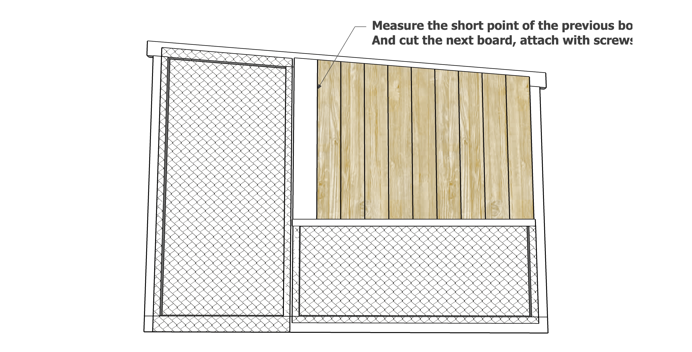](imagenes/paso-5.jpg)

> 📐 **Texto en la imagen (traducido al español):**
> - Medir el punto corto de la tabla anterior y cortar la siguiente; fijar con tornillos

Mide la longitud del punto corto de la primera tabla y usa esa medida para cortar la siguiente. Es posible que necesites comenzar con una tabla nueva, pero eventualmente podrás usar los retazos sobrantes a medida que los cortes se acorten.

Fija con tornillos autoperforantes cortos, dos tornillos por unión.

---

### Paso 6 — Travesaños centrales

[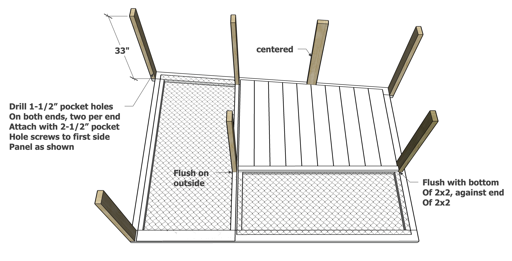](imagenes/paso-6.jpg)

> 📐 **Texto en la imagen (traducido al español, medidas en centímetros):**
> - Travesaño de **84 cm**, centrado
> - Perforar agujeros de bolsillo de **3,8 cm** en ambos extremos, dos por extremo
> - Fijar con tornillos de bolsillo de **6,4 cm** al primer panel lateral como se muestra
> - El listón 2×2 queda contra el extremo del listón 2×2 del marco

Perfora dos agujeros de bolsillo de **38 mm** en cada extremo de las piezas 2×4 de **84 cm**. Fija según muestra el diagrama.

> **Nota:** Se puede agregar otro 2×4 en el extremo inferior; esto se omitió para facilitar la limpieza, pero está indicado en las fotos.

---

### Paso 7 — Unión del segundo panel lateral

[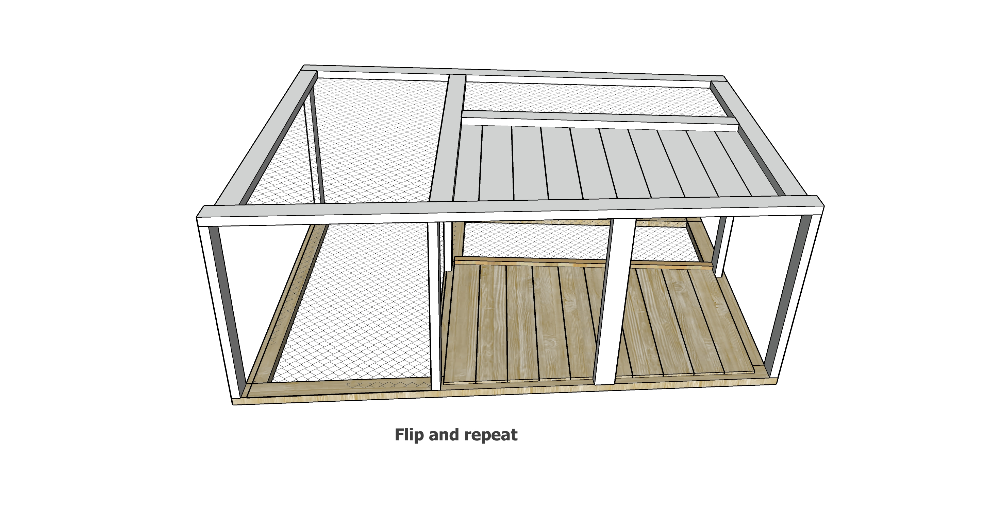](imagenes/paso-7.jpg)

> 📐 **Texto en la imagen (traducido al español):**
> - Voltear la estructura y repetir — fijar el segundo panel lateral con tornillos de bolsillo

Voltea la estructura sobre el segundo panel lateral y fija con tornillos de bolsillo.

---

### Paso 8 — Listones interiores 2×2

[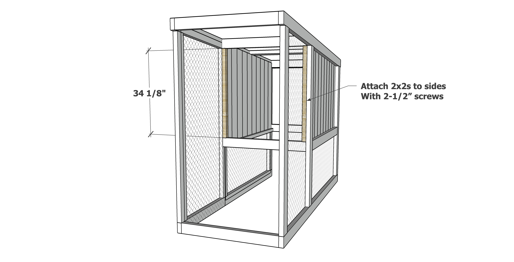](imagenes/paso-8.jpg)

> 📐 **Texto en la imagen (traducido al español):**
> - Fijar los listones 2×2 al interior con tornillos de **6,4 cm**

Agrega los listones 2×2 al interior para terminar las paredes interiores.

---

### Paso 9 — Tablas de cerco interiores

[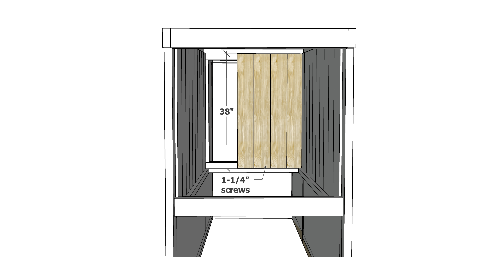](imagenes/paso-9.jpg)

Agrega las tablas de cerco al interior con los tornillos autoperforantes cortos. Guarda los retazos para las puertas.

Esta abertura funciona como ventilación y como puerta. Como da a un corral cerrado, no se le agrega puerta adicional.

---

### Paso 10 — Piso

[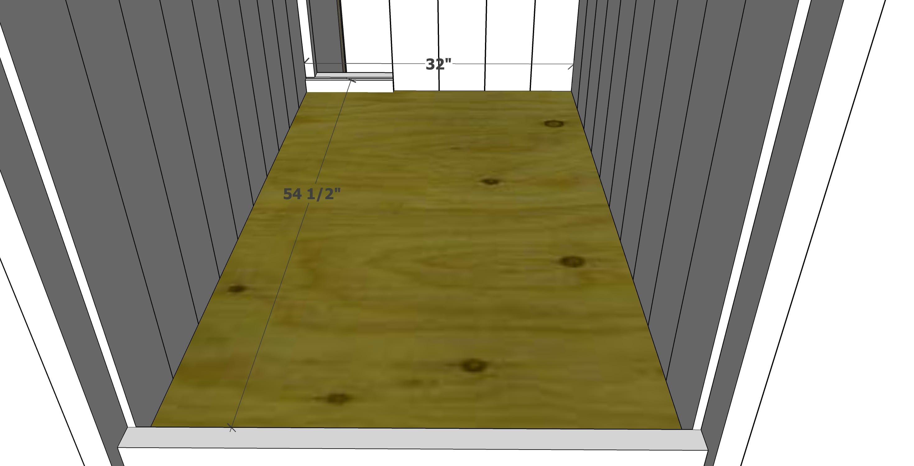](imagenes/paso-10.jpg)

Corta el piso y colócalo en su lugar. El piso se corta aproximadamente **12 mm** más pequeño para facilitar su extracción. No se atornilla, para que pueda retirarse cuando sea necesario.

> **Nota:** El listón trasero evita que la cama se caiga al abrir la puerta.

---

### Paso 11 — Puerta frontal (corral)

[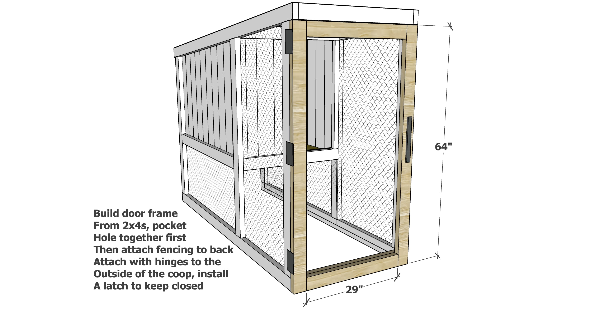](imagenes/paso-11.jpg)

> 📐 **Texto en la imagen (traducido al español):**
> - Construir el marco de la puerta con 2×4, unir con tornillos de bolsillo
> - Luego fijar la malla por la parte trasera
> - Instalar con bisagras por el exterior del gallinero
> - Colocar un pasador para mantener la puerta cerrada

Construye el marco de la puerta con agujeros de bolsillo de **38 mm** y tornillos de bolsillo de **65 mm**. Fija la malla de gallinero por la parte trasera. Instala al gallinero con bisagras y usa un pasador para cerrar.

---

### Paso 12 — Puerta trasera

[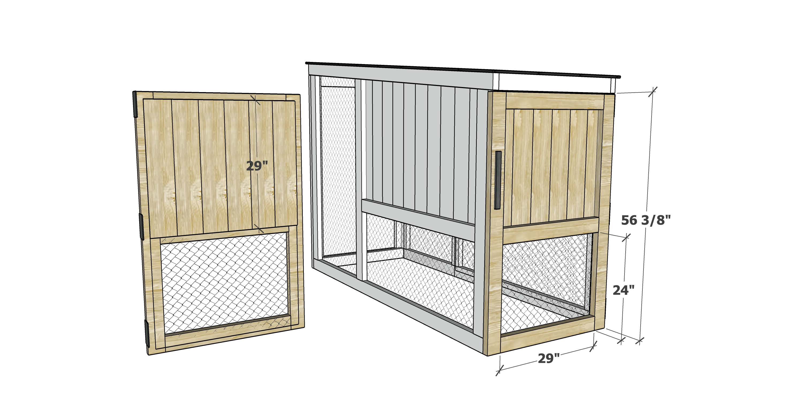](imagenes/paso-12.jpg)

> 📐 **Texto en la imagen (traducido al español, medidas en centímetros):**
> - Ancho de la puerta trasera: **143,2 cm**

Construye la puerta trasera, cubre la parte superior con tablas de cerco y la parte inferior con malla de gallinero. Instala con bisagras y un pasador.

> **Nota:** La puerta completa mejora la limpieza del nivel inferior.

---

### Paso 13 — Techo de zinc

[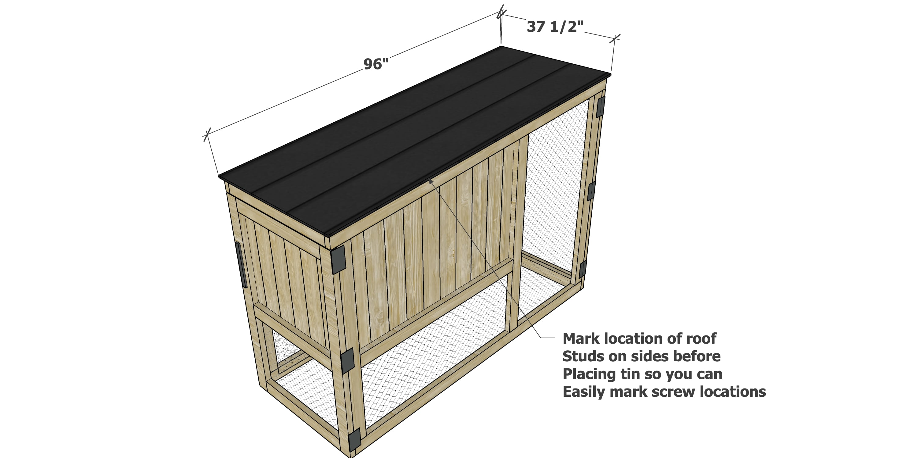](imagenes/paso-13.jpg)

> 📐 **Texto en la imagen (traducido al español, medidas en centímetros):**
> - Profundidad de la plancha de zinc: **95 cm** | Largo: **244 cm**
> - Marcar en los laterales la ubicación de los travesaños del techo antes de colocar la plancha de zinc, para identificar fácilmente dónde atornillar

Este gallinero está diseñado para usar una plancha de zinc estándar de 2,44 m de largo. Simplemente deslízala sobre el techo y atorníllala a las piezas 2×4 de la cubierta con tornillos para metal.

---

### Paso 14 — Nidal (ponedero)

[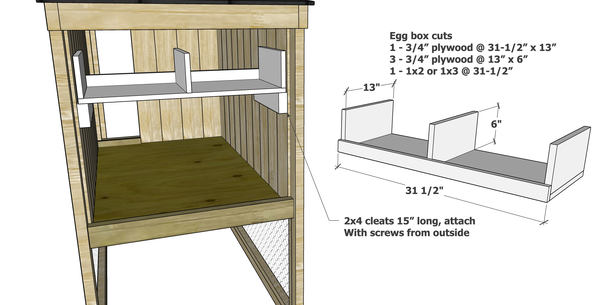](imagenes/paso-14.jpg)

> 📐 **Texto en la imagen (traducido al español, medidas en centímetros):**
> - Cortes para el nidal:
>   - 1 — plywood 19 mm @ **80 cm × 33 cm** (fondo)
>   - 3 — plywood 19 mm @ **33 cm × 15 cm** (separadores)
>   - 1 — listón 1×2 o 1×3 @ **80 cm**
> - Largo interior del nidal: **80 cm**
> - Topes 2×4 de **38 cm** de largo; fijar con tornillos desde el exterior

El nidal se puede construir con retazos de plywood de **19 mm**. Se puede ensamblar con tornillos de bolsillo o con tornillos de **65 mm**.

---

## Preguntas frecuentes

**¿Cómo aíslo el gallinero?**
Hay muchas formas de aislar. El cielo puede aislarse con plancha de foam (poliestireno expandido) fijada con fijadores especiales. El piso puede cubrirse con una capa gruesa de paja. Las paredes pueden aislarse con aislante reflectante en rollo, cartón grapado o foam, aunque puede ser necesario agregar plywood de 6 mm encima para evitar que las gallinas lo picotéen. Las puertas pueden cubrirse con mantas en invierno. Evita sellar completamente el gallinero; debe ventilar para prevenir acumulación de humedad.

**¿Es muy pesado?**
Sí. Dos personas pueden moverlo, pero no es tarea fácil. Se recomienda contar con más ayuda. Considera prefabricar los paneles y puertas, y luego ensamblar en el lugar definitivo.

**¿Se lo lleva el viento?**
En zonas de mucho viento, no lo orientes de lado hacia la dirección del viento. Fijar estacas al suelo también ayuda. Es resistente y difícilmente se volcaría.

**¿Qué madera usar?**
**Pino Oregón** (disponible en Chile en Sodimac, Easy y madereras) para las piezas 2×4 es una buena opción por su equilibrio entre costo y durabilidad. El **cedro** o el **ciprés** también son buenas alternativas para mayor resistencia a la humedad. No se recomienda madera tratada, ya que las gallinas pueden picotearla y los químicos podrían terminar en los huevos. Elevar la base sobre baldosas de hormigón ayuda con el drenaje.

**¿Puedo convertirlo en gallinero móvil (tractor)?**
Sí, agregar manijas en los extremos o ruedas en el lado más pesado (la parte trasera) lo hace más portable.

**¿Qué terminación usar?**
Se recomienda una tintura semitransparente de base agua para el exterior. El interior puede dejarse sin tratar. Es buena idea aplicar capas gruesas de barniz poliuretano al piso para facilitar la limpieza.

---

*Plano e instrucciones originales por [Ana White](https://www.ana-white.com/woodworking-projects/small-modern-chicken-coop). Adaptado al español chileno con medidas métricas y materiales locales.*
